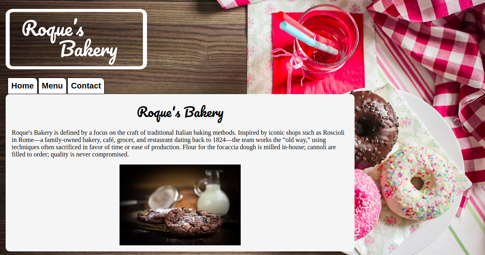

<h1 align="center">Restaurant Page [ -- Roque's Bakery -- ]</h1>

> The goal of this project is demonstrate mastery with the DOM manipulation by dynamically rendering a simple bakery homepage. In this page I used JavaScript alone to generate the entire contents of the website!

### You can access a Live Demo [HERE](https://raw.githack.com/MarilenaRoque/restaurantPage/feature/webpage/dist/index.html)

## Built With

- Javascript
- Webpack
- HTML5
- CSS3

## Getting Started

To get a local copy up and running follow these simple steps.

- Clone this repository
 > `git clone <repo>`
- Navigate to the Repo Folder
- To set Webpack and the dependencies run the command
> `npm install`
- Use your favorite browser the index.html file (located at the root)

## Authors

👤 **Marilena Roque**

- Github: [MarilenaRoque](https://github.com/MarilenaRoque)
- Twitter: [@MariRoq88285995](https://twitter.com/MariRoq88285995)
- Linkedin: [roquemarilena](https://www.linkedin.com/in/roquemarilena/)

## 🤝 Contributing

Contributions, issues and feature requests are welcome!

Feel free to check the [issues page](issues/).

## Show your support

Give a ⭐️ if you like this project!